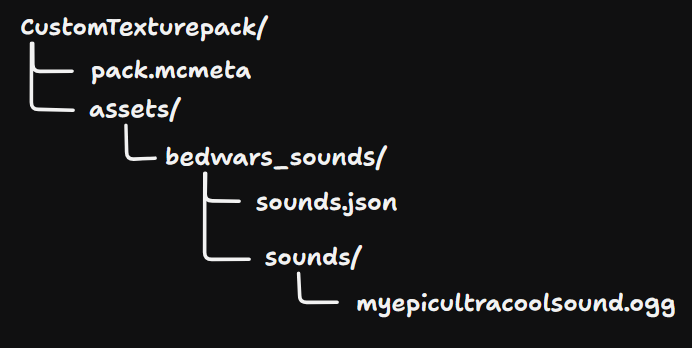

# Bedwars Sounds
Simply plays custom sounds listed in [assets](src/main/resources/assets/bedwars_sounds/sounds) when you kill someone.
Original mod by [pinkulu](https://github.com/catsonluna/SoundMod). 

## Adding Custom sounds:

1. Create a resource pack structured as shown below:


2. Inside pack.mcmeta:
```
   {
        "pack": {
            "pack_format": 1,
            "description": "My Custom BedWars Sounds"
        }
    }
```

3. Inside sounds.json:

```
{
  "myepicultracoolsound": {
    "category": "player",
    "sounds": [
      "bedwars_sounds:myepicultracoolsound"
    ],
    "stream": false
  }
}
```
   